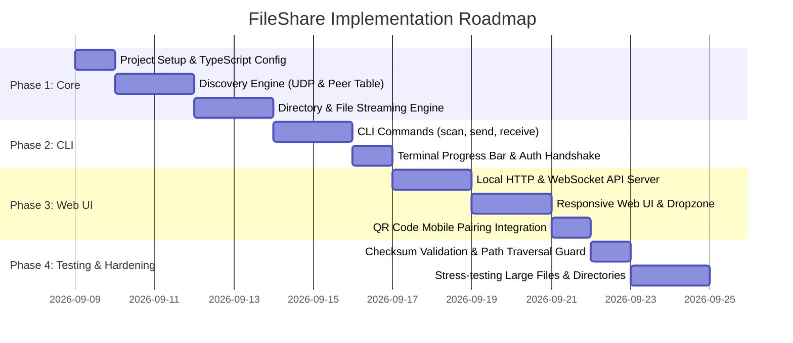

# LAN & Wi-Fi File Sharing Application Plan (CLI & UI)

A comprehensive technical architecture and implementation roadmap for a cross-platform local network (LAN / Wi-Fi) file sharing system.

---

## 1. Executive Summary & Goals

The goal is to build an application that enables users to securely send and receive files and complete directories across devices connected to the same Local Area Network (LAN) or Wi-Fi.

### Key Highlights:
- **Dual Interface**: Full-featured **Command-Line Interface (CLI)** and a modern, responsive **Web UI**.
- **Flexible Payloads**: Send single files, multiple selected files, or complete nested directories in one go.
- **Zero Cloud / Local Only**: No external server or internet connection required; transfers occur directly at wire/Wi-Fi speed.
- **Zero Configuration Discovery**: Automatic peer detection via UDP broadcast and mDNS; QR code pairing for mobile browsers.
- **Cross-Platform**: Windows, macOS, Linux, and mobile devices (via browser).

---

## 2. System Architecture

```
               ┌────────────────────────────────────────────────────────┐
               │                     User Layer                         │
               │   CLI (`fileshare`)    │   Web UI / Mobile Browser     │
               └───────────┬────────────┴───────────────┬───────────────┘
                           │                            │
 ┌─────────────────────────┴────────────────────────────┴──────────────────────────┐
 │                               Application Core                                  │
 │                                                                                │
 │  ┌────────────────────────┐  ┌───────────────────────┐  ┌───────────────────┐  │
 │  │    Discovery Engine    │  │   Transfer Engine     │  │   Security Layer  │  │
 │  │  - UDP Broadcast/mDNS  │  │ - Streaming Archiver  │  │ - PIN / OTP Auth  │  │
 │  │  - Peer Beaconing      │  │ - Chunked HTTP/TCP    │  │ - SHA-256 Hashes  │  │
 │  │  - Heartbeat & Status  │  │ - Resume & Progress   │  │ - TLS / Local Key │  │
 │  └────────────────────────┘  └───────────────────────┘  └───────────────────┘  │
 │                                                                                │
 │  ┌──────────────────────────────────────────────────────────────────────────┐  │
 │  │                           Filesystem I/O                                 │  │
 │  │  - Stream reader/writer   - Directory walker   - Safe path resolver      │  │
 │  └──────────────────────────────────────────────────────────────────────────┘  │
 └──────────────────────────────────────┬─────────────────────────────────────────┘
                                        │
                         [ Wi-Fi / Local Area Network ]
                                        │
 ┌──────────────────────────────────────┴─────────────────────────────────────────┐
 │                                Remote Peer                                     │
 └────────────────────────────────────────────────────────────────────────────────┘
```

---

## 3. Core Functional Capabilities

### 3.1 Network Discovery & Peer Management
1. **UDP Broadcast Beaconing**:
   - Nodes periodically broadcast a presence beacon (default UDP port `53535`).
   - Packet contains: Node ID, machine name, OS, HTTP transfer port, WebSocket port, and protocol version.
2. **mDNS Service Publishing**:
   - Publishes `_fileshare._tcp.local` for zero-configuration hostnames (e.g., `alice-laptop.local:8990`).
3. **QR Code Pairing for Mobile**:
   - The desktop app generates a Wi-Fi QR code containing the local HTTP URL (`http://192.168.1.X:8990`).
   - Mobile phones scan the QR code to open the Web UI without needing to install any app.
4. **Manual IP Fallback**:
   - If a router blocks UDP broadcasts (AP isolation), users can connect directly using `fileshare send <path> --to 192.168.1.50:8990`.

### 3.2 File & Directory Streaming (Multi-File / Directory in One Go)
1. **On-the-Fly Directory Streaming**:
   - When sending a directory tree, files are walked recursively and streamed as a standardized `tar` stream on the fly.
   - **No temporary archive files** are written to disk on either sender or receiver; data streams directly from the sender's disk to the network, and unpacked straight onto the receiver's disk.
2. **Batch File Transfers**:
   - Multiple files selected across different folders are bundled into a single streaming session with manifest metadata.
3. **Chunked Streaming & Backpressure**:
   - High-throughput chunked HTTP/1.1 or HTTP/2 transfer with streaming backpressure to ensure stable memory consumption even when transferring 100+ GB files.
4. **Integrity Verification**:
   - Stream calculates SHA-256 digests in real-time. Hashes are cross-verified upon completion.

### 3.3 Security & Safety
1. **Interactive Transfer Consent**:
   - The recipient must explicitly accept incoming transfer requests before data transmission starts (with `--auto-accept` flag available for headless/CLI automation).
2. **One-Time Pairing PIN**:
   - Optional 6-digit confirmation code displayed on both sender and receiver screens to prevent accidental or malicious file delivery on shared networks.
3. **Path Traversal Protection**:
   - Strict sanitization of relative paths to prevent directory traversal attacks (e.g., `../../etc/passwd` or `..\System32`). All received files are constrained to the configured target directory.

---

## 4. User Interfaces

### 4.1 Command-Line Interface (CLI)

Designed for speed, terminal power-users, and script automation.

```bash
# Discover peers on the local network
$ fileshare scan
Found 2 peers on Wi-Fi:
  [1] Alice-MacBook   (192.168.1.42:8990) - macOS
  [2] Home-Server     (192.168.1.10:8990) - Linux

# Send single or multiple files
$ fileshare send document.pdf photo.jpg --to 192.168.1.42

# Send entire directories (preserves structure)
$ fileshare send ./Projects/AppCode/ ./Datasets/ --to Alice-MacBook

# Receive files (interactive prompt or daemon mode)
$ fileshare receive --dir ~/Downloads
[Transfer Request] Alice-MacBook wants to send 3 files (450 MB). Accept? [Y/n]: y
Receiving: [████████████████████░░░░░░░░] 72% | 45 MB/s | ETA: 4s

# Launch local Web UI server
$ fileshare ui --port 8990
Serving FileShare Web UI at:
  > Local:   http://localhost:8990
  > Network: http://192.168.1.15:8990
```

### 4.2 Web User Interface (UI)

A modern, responsive web application served by the local daemon:
- **Radar View / Peer Grid**: Visual cards for each active device detected on Wi-Fi, showing device name, OS badge, and status.
- **Dropzone**: Drag-and-drop zone accepting both individual files and folders (using HTML5 `webkitdirectory` & DataTransfer item traversal).
- **Live Transfer Deck**:
  - Live progress circle / progress bar.
  - Transfer speed meter (MB/s) and estimated time remaining.
  - Active file count and individual file progress.
- **Incoming Request Overlay**: Clean modal displaying sender details, file listing, total size, and Accept/Decline controls.
- **Mobile Optimized**: Responsive layout with camera/photo upload buttons, allowing instant file push from phone to PC.

---

## 5. Technology Stack Selection

| Layer | Recommended Stack | Benefits |
| :--- | :--- | :--- |
| **Runtime & Language** | **Node.js (TypeScript)** | Single unified codebase for CLI and Web server; cross-platform; rich ecosystem for streaming archives (`tar-stream`, `archiver`). |
| **Networking** | **Native HTTP/2 & WebSockets** | WebSockets for low-latency peer signaling & progress; HTTP chunked streams for raw file payload speed. |
| **Discovery** | **UDP Datagrams (`dgram`) + mDNS** | Native UDP broadcasting with zero external native build dependencies; automatic fallback to manual IP. |
| **CLI Framework** | **Commander.js + Chalk + Ora / Cli-Progress** | Industry standard, responsive CLI UX with rich progress bars and tables. |
| **Web Frontend** | **Modern Vanilla Web Components / Vite + Tailwind** | Ultra-fast startup, zero heavy dependencies, minimal memory footprint when running as a background service. |

---

## 6. Detailed Project Structure

```
FileShare/
├── bin/
│   └── fileshare.js               # CLI executable entry point
├── src/
│   ├── cli/
│   │   ├── commands/
│   │   │   ├── scan.ts            # LAN peer discovery command
│   │   │   ├── send.ts            # File/Directory sending command
│   │   │   ├── receive.ts         # File receiving daemon
│   │   │   └── ui.ts              # Launch Web UI command
│   │   └── formatters.ts          # Terminal progress bars & tables
│   ├── core/
│   │   ├── discovery/
│   │   │   ├── broadcaster.ts     # UDP announcement broadcaster
│   │   │   └── listener.ts        # UDP peer listener & registry
│   │   ├── transfer/
│   │   │   ├── packStream.ts      # Streaming tar pack engine
│   │   │   ├── unpackStream.ts    # Streaming tar unpack & safe writer
│   │   │   └── hashStream.ts      # On-the-fly SHA-256 verifier
│   │   ├── security/
│   │   │   ├── pin.ts             # 6-digit session PIN generator
│   │   │   └── pathGuard.ts       # Path traversal prevention
│   │   └── config.ts              # Network ports and default paths
│   ├── server/
│   │   ├── httpServer.ts          # Express/Fastify transfer routes
│   │   ├── wsServer.ts            # WebSocket signaling & live status
│   │   └── staticServer.ts        # Static assets server for Web UI
│   └── ui/
│       ├── index.html             # Single-page UI dashboard
│       ├── css/
│       │   └── style.css          # Modern dark mode design
│       └── js/
│           ├── app.js             # UI controller & WebSocket client
│           ├── dropzone.js        # File/Folder drag-and-drop handler
│           └── qr.js              # Wi-Fi pairing QR code generator
├── tests/
│   ├── discovery.test.ts
│   ├── streaming.test.ts
│   └── pathGuard.test.ts
├── package.json
├── tsconfig.json
└── README.md
```

---

## 7. Implementation Roadmap



---

## 8. Verification & Test Plan

1. **Discovery Test**:
   - Start instances on two separate devices on the same Wi-Fi. Verify both appear in `fileshare scan` within 2 seconds.
2. **Single & Multi-File Transfer**:
   - Send diverse file types (images, videos, documents). Verify byte-for-byte SHA-256 equality.
3. **Deep Directory Transfer**:
   - Send a nested directory tree with 5,000+ files and hidden files (`.git`, `.env`). Verify directory structure, permissions, and file counts match.
4. **Cross-Interface Interoperability**:
   - Send from CLI -> receive on Web UI.
   - Send from mobile phone browser -> receive on CLI daemon.
5. **Security & Edge Cases**:
   - Verify rejection when PIN is incorrect.
   - Verify malicious path payload (`../../system`) is safely jailed within the target download directory.
