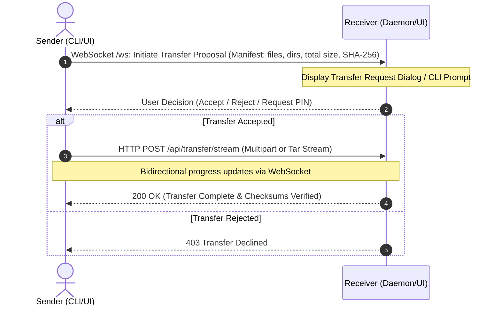

# LAN & Wi-Fi File Sharing Application Plan (CLI & UI)

A high-performance, cross-platform file sharing solution designed for local area networks (LAN) and Wi-Fi networks. It enables users to transfer individual files, multiple selected files, or entire nested directory structures with zero cloud dependencies, ultra-fast local transfer speeds, and dual interfaces (Command Line Interface and a modern Web UI).

---

## 1. System Architecture Overview

```
               ┌────────────────────────────────────────────────────────┐
               │                     User Layer                         │
               │   CLI (`fileshare`)    │   Web UI / Mobile Browser     │
               └───────────┬────────────┴───────────────┬───────────────┘
                           │                            │
 ┌─────────────────────────┴────────────────────────────┴──────────────────────────┐
 │                               Application Core                                  │
 │                                                                                │
 │  ┌────────────────────────┐  ┌───────────────────────┐  ┌───────────────────┐  │
 │  │    Discovery Engine    │  │   Transfer Engine     │  │   Security Layer  │  │
 │  │  - UDP Broadcast/mDNS  │  │ - Streaming Archiver  │  │ - PIN / OTP Auth  │  │
 │  │  - Peer Beaconing      │  │ - Chunked HTTP/TCP    │  │ - SHA-256 Hashes  │  │
 │  │  - Heartbeat & Status  │  │ - Resume & Progress   │  │ - TLS / Local Key │  │
 │  └────────────────────────┘  └───────────────────────┘  └───────────────────┘  │
 │                                                                                │
 │  ┌──────────────────────────────────────────────────────────────────────────┐  │
 │  │                           Filesystem I/O                                 │  │
 │  │  - Stream reader/writer   - Directory walker   - MIME detector           │  │
 │  └──────────────────────────────────────────────────────────────────────────┘  │
 └──────────────────────────────────────┬─────────────────────────────────────────┘
                                        │
                         [ Wi-Fi / Local Area Network ]
                                        │
 ┌──────────────────────────────────────┴─────────────────────────────────────────┐
 │                                Remote Peer                                     │
 └────────────────────────────────────────────────────────────────────────────────┘
```

---

## 2. Core Functional Requirements

### 2.1 Network Discovery & Connection
- **Zero Configuration**: Devices on the same subnet (LAN/Wi-Fi) discover each other automatically via UDP broadcasts (default port `53535`) or mDNS/DNS-SD (`_fileshare._tcp`).
- **Device Metadata**: Peers announce hostname, device type (PC, Mac, Linux, Mobile), IP address, service port, and pairing capability.
- **QR Code Pairing**: Web UI displays a local Wi-Fi QR code for mobile devices (phones/tablets) to instantly connect and transfer files without installing any client.
- **Manual IP Fallback**: Support direct connection via `IP:PORT` if UDP broadcast is blocked by network router isolation.

### 2.2 File & Directory Streaming
- **Multiple Files in One Go**: Send batches of mixed files with aggregate progress tracking.
- **Full Directory Streaming**: Recursively walk directories and stream them using an on-the-fly streaming tar/zip archive (zero temporary disk overhead on sender, streams directly to recipient).
- **Preserved Directory Hierarchy**: Maintains directory structure, relative paths, and file attributes.
- **Chunked Transfer**: High-speed chunked HTTP/TCP streaming with backpressure handling (handles files ranging from a few KB to 100+ GB without memory spikes).
- **Integrity Verification**: Real-time SHA-256 checksum calculation and verification per file.

### 2.3 Security & Permission Model
- **Accept/Reject Prompt**: Incoming transfers require explicit confirmation on the receiver's end (can be configured to `--auto-accept` for trusted local networks/CLI automation).
- **6-Digit Pair PIN / SAS Code**: Optional short verification code displayed on both sender and receiver to prevent rogue uploads on shared networks (e.g., office or public Wi-Fi).
- **Download Directory Isolation**: Restricts recipient file writing strictly to a configured download folder to prevent path traversal attacks (`../`).

---

## 3. Interfaces Design

### 3.1 Command Line Interface (CLI)

The CLI provides commands for headless servers, developer workflows, and scripting:

```bash
# 1. Discover active peers on LAN
fileshare scan

# 2. Send single file, multiple files, or entire directories
fileshare send ./report.pdf ./photos/ ./videos/ --to 192.168.1.45
fileshare send ./project-folder/ --to "Alice-MacBook"

# 3. Receive files in headless daemon mode
fileshare receive --dir ~/Downloads --auto-accept

# 4. Launch local Web UI and server
fileshare ui --port 8080
```

#### CLI Flags & Options:
- `--to <target>`: IP address, hostname, or discovered peer name.
- `--pin <code>`: Specify a one-time 6-digit PIN for authenticated transfer.
- `--port <number>`: Custom transfer port (default: `8990`).
- `--dir <path>`: Destination directory for received files.
- `--compress`: Enable gzip/zstd on-the-fly compression for text/source-code transfers.

### 3.2 Web User Interface (UI)

A responsive single-page application served locally, accessible via desktop browser or mobile phone:

- **Peer Radar / Discovery Deck**: Displays detected devices on the network as clickable cards with device icons, IP, and status.
- **Drag-and-Drop Dropzone**: Supports dropping individual files or full directory folders directly.
- **Transfer Queue & Progress Monitor**:
  - Overall progress bar + per-file progress.
  - Transfer speed (MB/s), elapsed time, and ETA.
  - Pause, resume, or cancel actions.
- **Incoming Transfer Modal**: Shows sender info, file count, total size, and directory tree preview before user accepts.
- **Transfer History**: Log of completed transfers with quick "Show in Folder" links.
- **Mobile Friendly**: Clean touch-optimized layout; allows mobile phones to select files or camera roll and upload directly to PC.

---

## 4. Recommended Technology Stack

| Component | Recommended Choice | Justification |
| :--- | :--- | :--- |
| **Backend & CLI Runtime** | **Node.js (TypeScript)** or **Go (Golang)** | - **Node.js / TS**: Fast development, rich ecosystem (`archiver`, `tar-stream`, `bonjour-service`), single package for CLI and Web server.<br>- **Go**: Single self-contained binary, zero runtime dependencies, high network I/O throughput. |
| **Transfer Protocol** | **HTTP/1.1 / HTTP/2 Chunked Stream + WebSockets** | WebSockets for real-time signaling, discovery heartbeats, and progress; HTTP chunked streams for high-speed file payloads. |
| **Peer Discovery** | **UDP Broadcast + mDNS** | Native mDNS for zero-config domain names (`.local`), UDP broadcast fallback for local subnets. |
| **Frontend Web UI** | **HTML5 + Vanilla CSS/Modern JS** or **Vite + React/Preact** | Single bundle embedded in the CLI binary or served from local static directory; minimal memory footprint. |
| **Streaming Archiver** | **`tar-stream` / `archiver`** | Streams directory trees on the fly with zero disk buffering. |

---

## 5. Network Protocol Specification

### 5.1 Discovery Broadcast Packet (UDP / Port 53535)
```json
{
  "protocol": "lan-fileshare-v1",
  "deviceId": "node-a4f21b",
  "deviceName": "Dev-Workstation",
  "os": "Windows",
  "httpPort": 8990,
  "wsPort": 8991,
  "status": "ready"
}
```

### 5.2 Handshake & Transfer Flow (WebSocket & HTTP)



---

## 6. Directory Structure for Implementation

```
FileShare/
├── bin/
│   └── fileshare.js               # CLI executable entry point
├── src/
│   ├── cli/
│   │   ├── commands/              # `send`, `receive`, `scan`, `ui`
│   │   └── formatters.js          # Terminal progress bar, tables, colors
│   ├── server/
│   │   ├── server.ts              # HTTP & WebSocket server
│   │   ├── routes/                # File transfer endpoints
│   │   └── wsHandler.ts           # Peer communication & signaling
│   ├── core/
│   │   ├── discovery.ts           # UDP/mDNS discovery service
│   │   ├── streamer.ts            # Directory archiver & chunked file streamer
│   │   ├── receiver.ts            # Safe path resolver & chunk writer
│   │   ├── security.ts            # PIN generator & SHA-256 verification
│   │   └── config.ts              # Default ports, downloads directory
│   └── ui/                        # Web UI (SPA)
│       ├── index.html             # Sleek dashboard & peer radar
│       ├── css/style.css          # Glassmorphism/modern dark UI
│       └── js/app.js              # Dropzone, WebSockets, transfer management
├── tests/                         # Unit and integration tests
├── package.json
├── tsconfig.json
└── README.md
```

---

## 7. Implementation Milestones

1. **Milestone 1: Core Networking & Discovery Engine**
   - Implement UDP broadcast broadcaster & listener.
   - Maintain dynamic list of active peers with automatic timeout for inactive devices.

2. **Milestone 2: Streaming Transfer Engine (Files & Folders)**
   - Build directory traversal and on-the-fly tar/zip streaming.
   - Implement safe write pipeline preventing path traversal exploits.
   - Build SHA-256 streaming verification.

3. **Milestone 3: CLI Suite**
   - Implement `fileshare scan`, `fileshare send`, `fileshare receive`.
   - Add real-time terminal progress indicators (percentage, speed, ETA).

4. **Milestone 4: Modern Web UI**
   - Create drag-and-drop dashboard for browser access.
   - Peer radar and QR code pairing for cross-device mobile sharing.
   - Connect UI to backend via WebSockets for live progress tracking.

5. **Milestone 5: Hardening & Testing**
   - Stress-test multi-gigabyte transfers and directories with thousands of nested files.
   - Verify network isolation edge cases and firewall notifications.

---

## User Review Required

> [!IMPORTANT]
> **Preferred Runtime & Tech Stack:**
> We recommend **Node.js with TypeScript** (lightweight, highly cross-platform, powers both the CLI and local Web UI within a single cohesive project). 
> Alternatively, **Go (Golang)** can compile into a single static binary.

> [!NOTE]
> Are there specific target operating systems you prioritize (Windows, macOS, Linux, Android/iOS via browser)? The proposed architecture works seamlessly across all platforms with zero client installation needed for mobile peers using the local Web UI.
